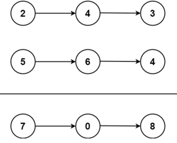

# [2. Add Two Numbers](https://leetcode.com/problems/add-two-numbers/description/)  

<code>Medium</code> level  

You are given two <strong>non-empty</strong> linked lists representing two non-negative integers. The digits are stored in <strong>reverse order</strong>, and each of their nodes contains a single digit. Add the two numbers and return the sum as a linked list.  
You may assume the two numbers do not contain any leading zero, except the number 0 itself.  

<strong>Example 1:</strong>   

  

<pre>
<strong>Input:</strong> l1 = [2,4,3], l2 = [5,6,4]
<strong>Output:</strong> [7,0,8]
<strong>Explanation:</strong> 342 + 465 = 807.
</pre>  

<strong>Example 2:</strong>  

<pre>
<strong>Input:</strong> l1 = [0], l2 = [0]
<strong>Output:</strong> [0]
</pre>  

<strong>Example 3:</strong>  

<pre>
<strong>Input:</strong> l1 = [9,9,9,9,9,9,9], l2 = [9,9,9,9]
<strong>Output:</strong> [8,9,9,9,0,0,0,1]
</pre>  

<p><strong>Constraints:</strong></p>

<ul>
	<li>The number of nodes in each linked list is in the range <code>[1, 100]</code>.</li>
	<li><code>0 <= Node.val <= 9</code></li>
	<li>It is guaranteed that the list represents a number that does not have leading zeros.</li>
</ul>  

***  

Розв'язування 

Типова задачка на <strong>Linked List</strong>. <code>Medium</code> рівень отримала, мабуть, тільки за розв’язок питання, що робити з перенесенням заряду. А так все по класиці - ітерація двох зв'язаних списків різної/однакової довжини та <strong>dummy</strong> вузол для спрощення побудови списку.  

По складності:  
Маємо ітерацію по довжинам двох списків: <code>n</code> та <code>m</code>. Відповідно <strong>Time complexity</strong>: <code>O(max(n, m))</code> або можно просто <code>O(n)</code>, де <code>n</code> - довжина довшого з списків.  
По <strong>Space complexity</strong>: <code>O(n)</code>, де <code>n</code> - виділена пам’ять під <code>n</code> нових об’єктів, у випадку якщо результат має <code>n</code> вузлів.  

```C++
/**
 * Definition for singly-linked list.
 * struct ListNode {
 *     int val;
 *     ListNode *next;
 *     ListNode() : val(0), next(nullptr) {}
 *     ListNode(int x) : val(x), next(nullptr) {}
 *     ListNode(int x, ListNode *next) : val(x), next(next) {}
 * };
 */
class Solution {
public:
    ListNode* addTwoNumbers(ListNode* l1, ListNode* l2) {
      ListNode dummy(0);
      ListNode* tail = &dummy;

      int carry = 0;

      while (l1 || l2 || carry) {
        int sum = carry;

        if (l1) {
            sum += l1->val;
            l1 = l1->next;
        }
        if (l2) {
            sum += l2->val;
            l2 = l2->next;
        }

        carry = sum / 10;
        tail->next = new ListNode(sum % 10);
        tail = tail->next;
      }

      return dummy.next;
    }
};
```  