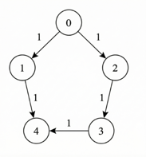
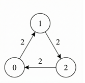
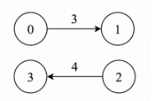

# [3977. Minimum Time To Reach Target With Limited Power](https://leetcode.com/problems/minimum-time-to-reach-target-with-limited-power/description/)  

<code>Hard</code> level  

You are given a <strong>directed</strong> weighted graph with <code>n</code> nodes labeled from 0 to <code>n - 1</code>.  

The graph is represented by a 2D integer array <code>edges</code>, where <code>edges[i] = [u<sub>i</sub>, v<sub>i</sub>, t<sub>i</sub>]</code> indicates a directed edge from node <code>u<sub>i</sub></code> to node <code>v<sub>i</sub></code> that takes <code>t<sub>i</sub></code> seconds to traverse.  

You are also given an integer <code>power</code> representing the initial available power, and an integer array <code>cost</code> of length <code>n</code>, where <code>cost[u]</code> represents the power required to forward the signal from node <code>u</code> through <strong>any</strong> one of its outgoing edges.  

You are given two integers <code>source</code> and <code>target</code>.  

The signal starts at <code>source</code> at time 0 with <code>power</code> units of power and follows these rules:  
<li>The signal may traverse a directed edge from node <code>u</code> only if the remaining power is <strong>at least</strong> <code>cost[u]</code>.</li>  
<li>No power is consumed when the signal arrives at a node, unless it later leaves that node by traversing another edge.</li>  
<li>When the signal is forwarded from node <code>u</code>, the remaining power is <strong>decreased</strong> by <code>cost[u]</code> units.</li>  
<li>Traversing an edge <code>edges[i] = [u<sub>i</sub>, v<sub>i</sub>, t<sub>i</sub>]</code> increases the total time by <code>t<sub>i</sub></code> seconds.</li>  

Return an integer <code>array</code> answer of size 2, where:  
<li><code>answer[0]</code> is the <strong>minimum</strong> time required for the signal to reach node target.</li>  
<li><code>answer[1]</code> is the <strong>maximum</strong> remaining power among all paths that achieve <code>answer[0]</code>.</li>  

If the signal cannot reach <code>target</code>, return <code>[-1, -1]</code>.  

<strong>Example 1:</strong>   

  

<pre>
<strong>Input:</strong> n = 5, edges = [[0,1,1],[1,4,1],[0,2,1],[2,3,1],[3,4,1]], power = 4, cost = [2,3,1,1,1], source = 0, target = 4  
<strong>Output:</strong> [3,0]
</pre>  

<strong>Explanation:</strong>  

<li>The signal starts at node 0 with 4 units of power.</li>
<li>The path <code>0 -> 1 -> 4</code> is not valid, because after leaving node 0, the signal has 2 units of power remaining, which is less than <code>cost[1] = 3</code>.</li>  
<li>The valid path <code>0 -> 2 -> 3 -> 4</code> takes a total time of 3.</li>  
<li>The total power consumed along this path is <code>cost[0] + cost[2] + cost[3] = 4</code>, leaving 0 remaining power.</li>  
<li>Hence, the answer is <code>[3, 0]</code>.</li>  

<strong>Example: 2</strong>

  

<pre>
<strong>Input:</strong> n = 3, edges = [[0,1,2],[1,2,2],[2,0,2]], power = 3, cost = [1,1,1], source = 1, target = 1  
<strong>Output:</strong> [0, 3]
</pre>  


<strong>Explanation:</strong>  

<li>Since the <code>source</code> and <code>target</code> are the same node, no traversal is required.</li>
<li>Hence, the minimum total time taken is 0, and no power is consumed.</li>
<li>Therefore, the answer is <code>[0, 3]</code>.</li>  

<strong>Example 3:</strong>  

  

<pre>
<strong>Input:</strong> n = 4, edges = [[0,1,3],[2,3,4]], power = 3, cost = [1,1,1,1], source = 0, target = 3  
<strong>Output:</strong> [-1, -1]
</pre>  

<strong>Explanation:</strong>  

<li>There is no valid path from <code>source</code> to <code>target</code>, therefore return <code>[-1, -1]</code>.</li>  

<strong>Constraints:</strong>  

<li><code>1 <= n <= 1000</li></code>
<li><code>0 <= edges.length <= 1000</li></code>
<li><code>edges[i] = [ui, vi, ti]</li></code>
<li><code>0 <= ui, vi <= n - 1</li></code>
<li><code>1 <= ti <= 109</li></code>
<li><code>1 <= power <= 1000</li></code>
<li><code>cost.length == n</li></code>
<li><code>1 <= cost[i] <= 2000</li></code>
<li><code>0 <= source, target <= n - 1</li></code>  

***

<strong>Solution</strong>  

```C++
class Solution {
public:
    std::vector<long long> minTimeMaxPower(int n, std::vector<std::vector<int>>& edges, int power, std::vector<int>& cost, int source, int target)
    {
      std::vector<std::vector<std::pair<int,int>>> g(n);
      
      for (const auto &e : edges) {
          int u = e[0], v = e[1], t = e[2];
          g[u].push_back({v, t});
      }

      const long long INF = 4e18;

      std::vector<std::vector<long long>> dist(n, std::vector<long long>(power + 1, INF));

      using State = std::tuple<long long, int, int>; 
      std::priority_queue<State, std::vector<State>, std::greater<State>> pq;

      dist[source][power] = 0;
      pq.push({0, source, power});

      while (!pq.empty()) {
        auto [time, u, p] = pq.top();
        pq.pop();

        if (time != dist[u][p]) continue;

        int np = p - cost[u];

        for (auto [v, t] : g[u]) {
            if (p < cost[u]) continue;

            long long nt = time + t;

            if (nt < dist[v][np]) {
                dist[v][np] = nt;
                pq.push({nt, v, np});
            }
        }
      }

      long long bestTime = INF;
      int bestPower = -1;

      for (int p = 0; p <= power; p++) {
        if (dist[target][p] < bestTime) {
            bestTime = dist[target][p];
            bestPower = p;
        } else if (dist[target][p] == bestTime) {
            bestPower = std::max(bestPower, p);
        }
      }

      if (bestTime == INF) return {-1, -1};

      return {bestTime, bestPower};
    }
};
```
