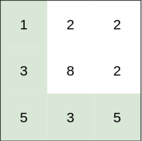
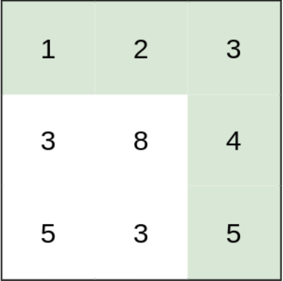
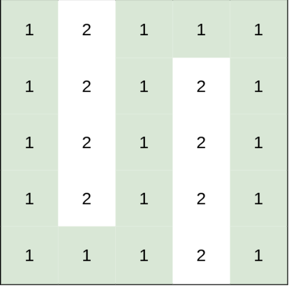

# [1631. Path With Minimum Effort](https://leetcode.com/problems/path-with-minimum-effort/description/)  

<code>Medium</code> level  

You are a hiker preparing for an upcoming hike. You are given <code>heights</code>, a 2D array of size <code>rows x columns</code>, where <code>heights[row][col]</code> represents the height of cell <code>(row, col)</code>. You are situated in the top-left cell, <code>(0, 0)</code>, and you hope to travel to the bottom-right cell, <code>(rows-1, columns-1)</code> (i.e., **0-indexed**). You can move **up, down, left**, or **right**, and you wish to find a route that requires the minimum **effort**.

A route's effort is the maximum absolute difference in heights between two consecutive cells of the route.

Return the *minimum **effort** required to travel from the top-left cell to the bottom-right cell*.  

**Example 1:**

<pre>
<strong>Input:</strong> heights = [[1,2,2],[3,8,2],[5,3,5]]
<strong>Output:</strong> 2
</pre>

**Explanation:**  
The route of [1,3,5,3,5] has a maximum absolute difference of 2 in consecutive cells.
This is better than the route of [1,2,2,2,5], where the maximum absolute difference is 3.  

**Example 2:**  

<pre>
<strong>Input:</strong> heights = [[1,2,3],[3,8,4],[5,3,5]]
<strong>Output:</strong> 1
</pre>

**Explanation:**  
The route of [1,2,3,4,5] has a maximum absolute difference of 1 in consecutive cells, which is better than route [1,3,5,3,5].

**Example 3:**

<pre>
<strong>Input:</strong> heights = [[1,2,1,1,1],[1,2,1,2,1],[1,2,1,2,1],[1,2,1,2,1],[1,1,1,2,1]]
<strong>Output:</strong> 0
</pre>

**Explanation:**  
This route does not require any effort.  

**Constraints:**

* <code>rows == heights.length</code>
* <code>columns == heights[i].length</code>
* <code>1 <= rows, columns <= 100</code>
* <code>1 <= heights[i][j] <= 106</code>

