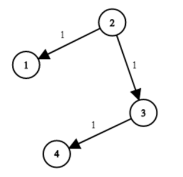

# [743. Network Delay Time](https://leetcode.com/problems/network-delay-time/description/)  

<code>Medium</code> level  

You are given a network of <code>n</code> nodes, labeled from <code>1</code> to <code>n</code>. You are also given <code>times</code>, a list of travel times as directed edges <code>times[i] = (ui, vi, wi)</code>, where <code>ui</code> is the source node, <code>vi</code> is the target node, and <code>wi</code> is the time it takes for a signal to travel from source to target.  
We will send a signal from a given node <code>k</code>. Return <i>the <strong>minimum</strong> time it takes for all the <code>n</code> nodes to receive the signal</i>. If it is impossible for all the n nodes to receive the signal, return <code>-1</code>.  

<strong>Example 1:</strong>   

  

<pre>
<strong>Input:</strong> times = [[2,1,1],[2,3,1],[3,4,1]], n = 4, k = 2
<strong>Output:</strong> 2
</pre>  

<strong>Example 2:</strong>  

<pre>
<strong>Input:</strong> times = [[1,2,1]], n = 2, k = 1
<strong>Output:</strong> 1
</pre>  

<strong>Example 3:</strong> 

<pre>
<strong>Input:</strong> times = [[1,2,1]], n = 2, k = 2
<strong>Output:</strong> -1
</pre>  

<strong>Constraints:</strong>

<ul>
	<li><code>1 <= k <= n <= 100</code></li>
	<li><code>1 <= times.length <= 6000</code></li>
	<li><code>times[i].length == 3</code></li>
	<li><code>1 <= ui, vi <= n</code></li>
	<li><code>ui != vi</code></li>
	<li><code>0 <= wi <= 100</code></li>
	<li>All the pairs <code>(ui, vi)</code> are <strong>unique</strong>. (i.e., no multiple edges.)</li>
</ul>  
